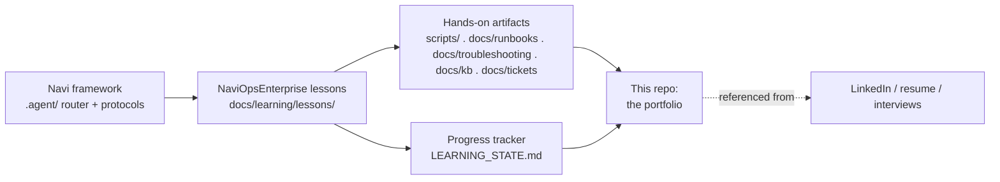

# NaviOpsEnterprise

**A self-built IT Operations & Service Desk academy — documented lesson by lesson, in public, on
top of [Navi](https://github.com/Navigator-Lab/Navi).** The fourth sibling to
[NaviOps](https://github.com/Navigator-Lab/NaviOps) (Linux/DevOps),
[NaviOpsNetwork](https://github.com/Navigator-Lab/NaviOpsNetwork) (Networking/NOC), and
[NaviOpsSec](https://github.com/Navigator-Lab/NaviOpsSec) (Security Operations) — built to the
same standards with an **IT Support, Help Desk, and Junior SysAdmin** curriculum.

> **AI disclosure:** lesson write-ups in this repo are produced with an AI tutor (Claude, via the
> Navi framework) that explains concepts, proposes hands-on labs, and grades quizzes. All
> hands-on artifacts (`scripts/`, runbooks, troubleshooting guides, KB articles, ticket notes,
> incident reports) and quiz answers are written by the operator. Commit history reflects the
> operator's own pace and iteration.

## What this is

NaviOpsEnterprise is two things at once:

1. **A real IT-support operation in miniature** — a lab AD domain, a Microsoft 365 / Google
   Workspace tenant model, a ticket queue, runbooks, troubleshooting guides, a knowledge base,
   and incident/RCA practice. Everything a service desk runs on.
2. **A build log** — the record of going from zero to **Help Desk Tier 1 → Help Desk Tier 2 → IT
   Support Specialist → Desktop Support Technician → Junior System Administrator → Infrastructure
   Support Engineer**, entirely by doing the work.

This is **not** a theory course. The unit of work is **the ticket**: every troubleshooting lesson
runs symptom → triage → diagnosis → resolution → documentation → closure, and produces real
artifacts you can show an employer.

## Support taught GUI-first, then at scale

The platform's signature: you learn to fix a problem in the **Windows GUI / admin console** the
way a tech does on the floor, then learn the **PowerShell / CLI** that scales, then map it to the
**cloud admin centers**.

```
ADUC  GPMC  Event Viewer  Services  Task Manager        # the floor: Windows consoles
Get-ADUser  Set-ADAccountPassword  gpresult  gpupdate   # PowerShell: at scale
ipconfig  nslookup  ping  tracert  Test-NetConnection   # connectivity diagnosis
Entra admin  Exchange admin  Teams admin  M365 admin     # Microsoft 365 cloud
Google Workspace Admin console                           # the Google side
```

## How it fits together



## Curriculum (36 lessons → IT-Support-ready)

| Module | Lessons | Focus |
|---|---|---|
| **IT & Hardware Foundations** | 01–03 | IT fundamentals, hardware, OS fundamentals |
| **The Two Desktops** | 04–07 | Windows, Linux for support, filesystems/storage, accounts & permissions |
| **Networking & Connectivity** | 08–09 | Networking fundamentals, DNS/DHCP & connectivity |
| **Peripherals & End-User Apps** | 10–14 | Printers, M365, Google Workspace, email, browser/web |
| **The Service Desk** | 15–17 | Ticketing systems, help-desk workflows, ITIL |
| **Identity & Directory** | 18–21 | Active Directory, Group Policy, provisioning/deprovisioning, password resets |
| **Windows Server & Endpoints** | 22–27 | Server, file shares, endpoint troubleshooting, software, patching, assets |
| **Operations Discipline** | 28–33 | Documentation/KB, security awareness, backup/recovery, incident mgmt, RCA, Jira SM |
| **Capstones** | 34–36 | Service-desk · IT-support · junior-sysadmin capstone projects |

Full map with skills, artifacts, and the role each lesson serves:
**[docs/learning/ROADMAP.md](docs/learning/ROADMAP.md)**.

## Every lesson follows a 12-section IT-Support schema

Theory → Tools & commands → Real-world support context → **Demonstration** → **Troubleshooting
workflow** (Symptoms → Causes → Diagnostics → Resolution → Escalation → Post-incident docs) →
**Ticket simulation** → **Service-desk / ITIL perspective** → Practical lab → GitHub artifact (the
6-piece evidence package) → Portfolio artifact → Certification crossover → Service & security
notes. Difficult concepts get **two teaching approaches** + an ASCII diagram. Each lesson produces
a **Runbook, Troubleshooting Guide, Ticket Notes, KB Article, Incident Report, and Portfolio
Artifact**. The schema is authoritative in
**[docs/learning/CLAUDE_TEACHING_RULES.md](docs/learning/CLAUDE_TEACHING_RULES.md)**.

## Start here

- **[docs/learning/ROADMAP.md](docs/learning/ROADMAP.md)** — the full 36-lesson roadmap + support
  career stages.
- **[docs/learning/PROJECT_MISSION.md](docs/learning/PROJECT_MISSION.md)** — the project's
  "constitution": mission, learning philosophy, definitions of done.
- **[docs/learning/CLAUDE_TEACHING_RULES.md](docs/learning/CLAUDE_TEACHING_RULES.md)** — the
  12-section IT-Support lesson schema (how every lesson is taught and graded).
- **[docs/learning/lessons/](docs/learning/lessons/)** — one folder per lesson.
- **Mappings & guides:**
  [Certification mapping](docs/learning/alignment/CERTIFICATION-MAPPING.md) ·
  [Role mapping](docs/learning/alignment/ROLE-MAPPING.md) ·
  [Portfolio guide](docs/learning/PORTFOLIO-GUIDE.md) ·
  [LinkedIn guide](docs/learning/LINKEDIN-GUIDE.md) ·
  [Interview prep](docs/learning/INTERVIEW-PREP.md) ·
  [SysAdmin path](docs/learning/SYSADMIN-PATH.md) ·
  [Capstone guide](docs/learning/CAPSTONE-GUIDE.md).
- **Playbooks:** [Help Desk](docs/learning/playbooks/HELPDESK-PLAYBOOK.md) ·
  [IT Support](docs/learning/playbooks/IT-SUPPORT-PLAYBOOK.md) ·
  [Documentation](docs/learning/playbooks/DOCUMENTATION-PLAYBOOK.md).
- **Capstones:** [the three projects](docs/learning/capstones/).
- **Operational libraries:** [Ticket library](docs/tickets/) · [Knowledge base](docs/kb/) ·
  [Runbooks](docs/runbooks/) · [Troubleshooting guides](docs/troubleshooting/).

## Repo layout

```
NaviOpsEnterprise/
├── .agent/              # Navi v28 framework core (router + protocols), unmodified
├── docs/
│   ├── STATUS.md / TODO.md / CHANGELOG.md / DECISIONS.md / DEFERRED.md
│   ├── learning/        # pedagogy layer (mission, schema, roadmap, progress, lessons,
│   │                    #   alignment/mappings, capstones, playbooks, career guides)
│   ├── runbooks/        # step-by-step "when this ticket comes in, do X"
│   ├── troubleshooting/ # symptom → cause → fix decision guides
│   ├── kb/              # end-user-facing knowledge base articles
│   ├── tickets/         # the realistic ticket library (100+)
│   ├── templates/       # ticket / KB / runbook / incident-report / RCA templates
│   └── reports/         # EXP/PLAN/etc. Navi reports
├── infra/               # lab build definitions (AD domain, M365 dev-tenant notes, client images)
└── scripts/             # PowerShell + Bash support automation (grows per lesson)
```

## Running this with Claude Code

Open this folder in Claude Code and run:

```
/navi <plain-language request>
```

`/navi` reads `navi.project.md` (this project's rules) and `docs/learning/` (the pedagogy layer)
and routes the request — e.g. "next lesson", "work this ticket", "explain how DNS resolves",
"write a runbook for printer offline", "onboard a new user in the lab".

## A note on what's NOT in this repo

This is a **public learning repo**. Real employer/tenant data, real user names or emails, internal
hostnames/asset tags, public IPs, license keys, and tokens are never committed — all tickets,
logs, and identities are lab-generated or sanitized (`corp.example`, RFC 1918 ranges, placeholder
users). See `navi.project.md` Hard Rules and the redaction convention in
`docs/learning/LEARNING_STATE.md`.

## License

MIT — see [LICENSE](LICENSE).
