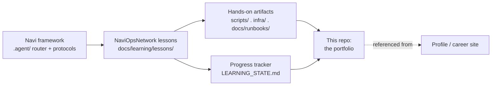

# NaviOpsNetwork

**A self-built Networking / NOC operations learning lab — documented lesson by lesson, in
public, on top of [Navi](https://github.com/Navigator-Lab/Navi).** Sibling to
[NaviOps](https://github.com/Navigator-Lab/NaviOps) (the Linux/DevOps platform), built to
the same standards with a **networking, network-operations, and network-security**
curriculum.

> **AI disclosure:** lesson write-ups in this repo are produced with an AI tutor (Claude,
> via the Navi framework) that explains concepts, proposes hands-on labs, and grades
> quizzes. All hands-on artifacts (`scripts/`, `infra/`, lab topologies, runbooks, captures)
> and quiz answers are written by the operator. Commit history reflects the operator's own
> pace and iteration.

## What this is

NaviOpsNetwork is two things at once:

1. **A small, real network-operations lab** — Linux networking diagnostics, packet capture,
   DNS/DHCP/NAT services, a monitoring stack (Prometheus/Grafana, SNMP, syslog), runbooks,
   NOC scenarios, and detection tooling.
2. **A build log** — the record of going from "knows what an IP address is" to
   **NOC Technician → Network Operations Engineer → Junior Network Engineer**, entirely by
   building #1, with a **Security Analyst (networking track)** on-ramp.

This is **not** an exam-cram platform. It is an **operational training platform**: every
lesson produces real artifacts — scripts, configs, lab topologies, troubleshooting
procedures, monitoring dashboards, incident reports, and practical evidence for GitHub.

## Networking taught Linux-first

The platform's signature: every protocol is taught from the **Linux CLI first**, then mapped
to Cisco/CCNA syntax — not the other way around.

```
ping  traceroute  tracepath  mtr        # reachability & path
ip    ss          netstat               # interfaces, routes, sockets (iproute2)
tcpdump  tshark   wireshark             # packet capture & analysis
dig   host        nslookup              # DNS
curl  wget        nc   ncat  socat      # services, ports, tunnels
openssl  nmap                           # TLS, recon & scanning
snmpwalk  journalctl  grep  awk  sed    # monitoring, logs, text processing
```

## How it fits together



## Curriculum (36 lessons → NOC-ready)

| Module | Lessons | Focus |
|---|---|---|
| **Foundations** | 01–06 | Fundamentals, OSI, TCP/IP, subnetting, IPv4, IPv6 |
| **Routing & Switching** | 07–11 | Routing, switching, VLANs, STP, EtherChannel |
| **Core Services** | 12–16 | DHCP, DNS, NAT/PAT, firewalls, network services |
| **Linux & Troubleshooting** | 17–20 | Linux networking, troubleshooting method, Wireshark, tcpdump |
| **Monitoring & Operations** | 21–27 | Monitoring, Prometheus/Grafana, Zabbix, SNMP, syslog, network IR, documentation |
| **Security & Advanced** | 28–33 | Network security, VPN, load balancing, HA, cloud & AWS networking |
| **Capstones** | 34–36 | CCNA capstone · NOC capstone · Network-Security capstone |

Full map with skills, artifacts, and the role each lesson serves:
**[docs/learning/ROADMAP.md](docs/learning/ROADMAP.md)**.

## Every lesson follows a 12-section schema

Concept (scientific theory) → Linux networking commands → Real-world use cases →
Troubleshooting → Common mistakes → **NOC perspective** → **Incident-response perspective** →
Practical lab → GitHub artifact → Portfolio artifact → RHCSA crossover → Security notes.
Difficult concepts (routing, VLANs, NAT, DNS, DHCP, BGP, OSPF, STP, VPN, load balancing) are
explained with **two different teaching approaches** + an ASCII diagram. The schema is
authoritative in **[docs/learning/CLAUDE_TEACHING_RULES.md](docs/learning/CLAUDE_TEACHING_RULES.md)**.

## Start here

- **[docs/learning/ROADMAP.md](docs/learning/ROADMAP.md)** — the full 36-lesson roadmap +
  NOC-first career stages.
- **[docs/learning/PROJECT_MISSION.md](docs/learning/PROJECT_MISSION.md)** — the project's
  "constitution": mission, learning philosophy, definitions of done.
- **[docs/learning/CLAUDE_TEACHING_RULES.md](docs/learning/CLAUDE_TEACHING_RULES.md)** — the
  12-section lesson schema (how every lesson is taught and graded).
- **[docs/learning/lessons/](docs/learning/lessons/)** — one folder per lesson.
- **Job alignment:** [NOC matrix](docs/learning/alignment/NOC-JOB-MATRIX.md) ·
  [CCNA matrix](docs/learning/alignment/CCNA-ALIGNMENT.md) ·
  [Network+ matrix](docs/learning/alignment/NETWORK-PLUS-ALIGNMENT.md).
- **Capstones:** [docs/learning/capstones/](docs/learning/capstones/).

## Repo layout

```
NaviOpsNetwork/
├── .agent/              # Navi v28 framework core (router + protocols), unmodified
├── docs/
│   ├── STATUS.md / TODO.md / CHANGELOG.md / DECISIONS.md / DEFERRED.md
│   ├── learning/         # pedagogy layer (mission, schema, roadmap, progress, lessons,
│   │                     #   alignment matrices, capstones, NOC modules)
│   ├── runbooks/         # incident reports (symptom → RCA → fix → verification)
│   ├── networking/       # cheatsheets (subnetting, dig, tcpdump filters)
│   ├── diagrams/         # ASCII / architecture diagrams
│   ├── dashboards/       # monitoring dashboard definitions/exports
│   └── reports/          # EXP/PLAN/etc. Navi reports
├── infra/                # lab topologies, monitoring stacks, device/service configs
└── scripts/              # Bash network automation (grows per lesson)
```

## Running this with Claude Code

Open this folder in Claude Code and run:

```
/navi <plain-language request>
```

`/navi` reads `navi.project.md` (this project's rules) and `docs/learning/` (the pedagogy
layer) and routes the request — e.g. "next lesson", "review this capture", "explain how NAT
works", "build a tcpdump filter for failed TLS handshakes".

## A note on what's NOT in this repo

This is a **public learning repo**. Real public IPs, router/switch management IPs, hostnames,
ISP/circuit IDs, SNMP community strings, device credentials, VPN PSKs, and raw `.pcap`
capture files are never committed — see `.gitignore`, `.gitleaks.toml`, and the redaction
convention in `docs/learning/LEARNING_STATE.md`. Labs use RFC 1918 / RFC 5737 documentation
ranges only.

## License

MIT — see [LICENSE](LICENSE).
