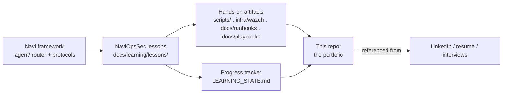

# NaviOpsSec

**A self-built Security Operations (Blue Team) academy — documented lesson by lesson, in
public, on top of [Navi](https://github.com/Navigator-Lab/Navi).** The third sibling to
[NaviOps](https://github.com/Navigator-Lab/NaviOps) (Linux/DevOps) and
[NaviOpsNetwork](https://github.com/Navigator-Lab/NaviOpsNetwork) (Networking/NOC), built to
the same standards with a **Security Operations, detection-engineering, and incident-response**
curriculum.

> **AI disclosure:** lesson write-ups in this repo are produced with an AI tutor (Claude, via
> the Navi framework) that explains concepts, proposes hands-on labs, and grades quizzes. All
> hands-on artifacts (`scripts/`, detection rules, runbooks, playbooks, investigation notes,
> incident reports) and quiz answers are written by the operator. Commit history reflects the
> operator's own pace and iteration.

## What this is

NaviOpsSec is two things at once:

1. **A small, real Security-Operations lab** — Linux log analysis & auditing, a Wazuh
   SIEM/XDR stack with agents and custom rules, detection content (Sigma + Wazuh rules),
   alert-triage and investigation workflows, threat hunting, and a full incident-response
   practice with runbooks, playbooks, and report templates.
2. **A build log** — the record of going from "Linux SysAdmin + NOC Technician" to
   **Security Analyst → SOC Analyst (T1/T2) → Security Operations Engineer / Incident
   Responder / Junior Detection Engineer**, entirely by building #1.

This is **not** a hacking course and **not** a penetration-testing course. It is a
**Blue-Team / Security-Operations** platform: every lesson produces real defensive artifacts —
detection rules, investigation scripts, runbooks, playbooks, incident reports, and portfolio
evidence for GitHub. Where a lesson generates an attack, it does so **only in a self-owned lab,
with benign payloads, for the purpose of detecting it.**

## Security taught Linux-first, then in the SIEM

The platform's signature: you learn to investigate an incident **directly on the box** with the
Linux toolkit first, then express the same detection in the **SIEM (Wazuh) and as portable
Sigma rules**.

```
journalctl  grep  awk  sed  cut  sort  uniq    # log analysis on the host
find  xargs  stat                              # file & persistence forensics
auditd  ausearch  aureport                     # the Linux audit trail
ss  netstat  ip  tcpdump  tshark               # network/forensic evidence
curl  wget  openssl  nmap                       # service probing & (lab) telemetry
Wazuh (manager/agent/rules/FIM/active-response)  + Sigma   # the SIEM layer
```

## How it fits together



## Curriculum (35 lessons → SOC-ready)

| Module | Lessons | Focus |
|---|---|---|
| **Security Foundations** | 01–03 | Security fundamentals, CIA/risk/threat/vuln, SOC fundamentals |
| **Linux Logging & Analysis** | 04–06 | Linux logs & auditing, `journalctl`/`grep`/`awk`/`sed`, syslog/log management |
| **Threat Knowledge** | 07–12 | Network-security fundamentals, threat modeling, threat intel, MITRE ATT&CK, kill chain, IOCs |
| **SIEM & Wazuh** | 13–16 | SIEM fundamentals, Wazuh deployment, Wazuh rules/alerts, log-analysis workflows |
| **Detection & Investigation** | 17–24 | Alert triage, failed-SSH/brute-force/port-scan detection, process & user investigation, web-attack analysis, FIM |
| **Hunting, Detection-Eng & IR** | 25–30 | Threat hunting, detection engineering, Sigma rules, incident response, containment/eradication/recovery, report writing |
| **Projects & Capstone** | 31–35 | Security-monitoring · Wazuh-detection · threat-hunting · SOC-operations projects · Security-Analyst capstone |

Full map with skills, artifacts, and the role each lesson serves:
**[docs/learning/ROADMAP.md](docs/learning/ROADMAP.md)**.

## Every lesson follows a 12-section SOC schema

Concept (theory) → Linux investigation commands → Threat context (MITRE ATT&CK) →
**Detection** → **Investigation & triage** → **SOC perspective** → **Incident-response
perspective** → Practical lab (simulate → detect → investigate) → GitHub artifact (the 6-piece
evidence package) → Portfolio artifact → Certification crossover → Security/adversary notes.
Difficult concepts are explained with **two different teaching approaches** + an ASCII diagram.
Each lesson maps the required flow **Concept → Lab → Detection → Investigation → Documentation →
Reporting** and produces a **Runbook, Playbook, Incident Report, Investigation Notes, Portfolio
Artifact, and GitHub Evidence**. The schema is authoritative in
**[docs/learning/CLAUDE_TEACHING_RULES.md](docs/learning/CLAUDE_TEACHING_RULES.md)**.

## Start here

- **[docs/learning/ROADMAP.md](docs/learning/ROADMAP.md)** — the full 35-lesson roadmap +
  analyst career stages.
- **[docs/learning/PROJECT_MISSION.md](docs/learning/PROJECT_MISSION.md)** — the project's
  "constitution": mission, learning philosophy, definitions of done.
- **[docs/learning/CLAUDE_TEACHING_RULES.md](docs/learning/CLAUDE_TEACHING_RULES.md)** — the
  12-section SOC lesson schema (how every lesson is taught and graded).
- **[docs/learning/lessons/](docs/learning/lessons/)** — one folder per lesson.
- **Mappings & guides:**
  [Certification mapping](docs/learning/alignment/CERTIFICATION-MAPPING.md) ·
  [Role mapping](docs/learning/alignment/ROLE-MAPPING.md) ·
  [Portfolio guide](docs/learning/PORTFOLIO-GUIDE.md) ·
  [LinkedIn guide](docs/learning/LINKEDIN-GUIDE.md) ·
  [Interview prep](docs/learning/INTERVIEW-PREP.md) ·
  [Capstone guide](docs/learning/CAPSTONE-GUIDE.md).
- **SOC operations modules:** [docs/learning/soc/](docs/learning/soc/) ·
  **IR workflows + templates:** [docs/learning/workflows/](docs/learning/workflows/).

## Repo layout

```
NaviOpsSec/
├── .agent/              # Navi v28 framework core (router + protocols), unmodified
├── docs/
│   ├── STATUS.md / TODO.md / CHANGELOG.md / DECISIONS.md / DEFERRED.md
│   ├── learning/         # pedagogy layer (mission, schema, roadmap, progress, lessons,
│   │                     #   alignment/mappings, capstones, SOC modules, IR workflows)
│   ├── runbooks/         # incident reports (detection → investigation → RCA → recovery)
│   ├── playbooks/        # detection & response playbooks
│   ├── templates/        # incident report / investigation notes / exec summary / RCA / evidence
│   ├── detections/       # Sigma + Wazuh rule library
│   ├── dashboards/       # SOC dashboard definitions/exports
│   └── reports/          # EXP/PLAN/etc. Navi reports
├── infra/                # Wazuh manager/agent configs, detection rules, lab targets
└── scripts/              # Bash investigation & detection automation (grows per lesson)
```

## Running this with Claude Code

Open this folder in Claude Code and run:

```
/navi <plain-language request>
```

`/navi` reads `navi.project.md` (this project's rules) and `docs/learning/` (the pedagogy
layer) and routes the request — e.g. "next lesson", "triage this alert", "explain the cyber
kill chain", "write a Sigma rule for SSH brute force", "investigate this suspicious process".

## A note on what's NOT in this repo

This is a **public learning repo**. Real public IPs, internal hostnames/asset names, employer
log data, usernames/credentials, API keys, Wazuh agent/cluster keys, and raw captures or logs
containing PII are never committed — see `.gitignore`, `.gitleaks.toml`, and the redaction
convention in `docs/learning/LEARNING_STATE.md`. All sample alerts and logs are lab-generated
or sanitized; labs use RFC 1918 / RFC 5737 documentation ranges only.

## License

MIT — see [LICENSE](LICENSE).
