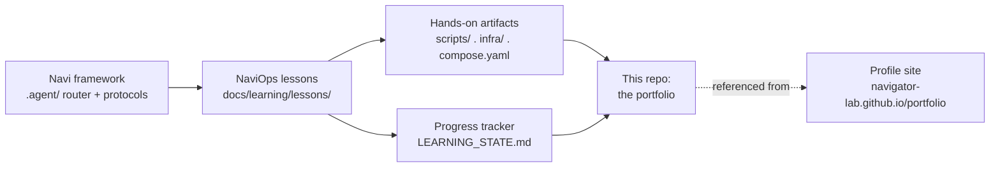

# NaviOps

**A self-built Linux/DevOps learning lab and ops platform — documented lesson by
lesson, in public, on top of [Navi](https://github.com/Navigator-Lab/Navi).**

> **AI disclosure:** lesson write-ups in this repo are produced with an AI tutor
> (Claude, via the Navi framework) that explains concepts, proposes hands-on tasks,
> and grades quizzes. All hands-on artifacts (`scripts/`, `infra/`, `compose.yaml`,
> runbooks) and quiz answers are written by the operator. Commit history reflects
> the operator's own pace and iteration.

## What this is

NaviOps is two things at once:

1. **A small, real ops platform** — health-check scripts, log analysis, monitoring,
   runbooks, and (later) AWS infrastructure-as-code via Terraform.
2. **A build log** — the record of going from "comfortable in a terminal" to
   **Junior Linux SysAdmin** and beyond, entirely by building #1.

The 27-lesson curriculum (`docs/learning/CURRICULUM.md`) covers Linux fundamentals,
Git/GitHub, Bash, networking, Docker, Ansible, CI/CD, Terraform, AWS, observability,
security monitoring, and RHCSA exam prep — each lesson produces a real artifact in
this repo.

## How it fits together



## Skills map

| Area | Lessons | Status |
|---|---|---|
| Linux filesystems & permissions | 01 | written |
| Git & GitHub | 02 | written |
| Bash scripting | 03 | written |
| Users, groups, processes | 04 | written |
| systemd, journald | 05 | written |
| Cron, logrotate | 06 | written |
| SSH, packages, storage | 07 | written |
| Networking (OSI/TCP-IP, subnetting) | 08 | written |
| DNS, DHCP, NAT, firewalls | 09 | written |
| Linux hardening & security basics | 10 | written |
| Docker fundamentals | 11 | written |
| Docker Compose (multi-container) | 12 | written |
| Ansible fundamentals | 13 | written |
| GitHub Actions / CI basics | 14 | written |
| AWS account, IAM | 15 | written |
| AWS EC2, VPC | 16 | written |
| AWS S3, EBS, backups | 17 | written |
| AWS CloudWatch monitoring | 18 | written |
| Log analysis & incident response | 19 | written |
| Terraform fundamentals | 20 | written |
| Advanced networking (VLAN/VPN/LB) | 21 | written |
| Observability (Prometheus/Grafana) | 22 | written |
| Security monitoring (Wazuh) | 23 | written |
| Multi-service Compose + monitoring | 24 | written |
| Terraform + AWS infra project | 25 | written |
| Capstone: incident response project | 26 | written |
| RHCSA exam prep & review | 27 | written |

"Written" = the lesson README (concept, real-world use, alternatives, hands-on spec,
verification, quiz, reflection) exists. The operator works through each lesson at
their own pace, building the hands-on artifact and answering the quiz before it's
marked complete in `docs/learning/LEARNING_STATE.md`.

## Start here

- **[docs/learning/CURRICULUM.md](docs/learning/CURRICULUM.md)** — the full 27-lesson
  roadmap, mapped to NaviOps artifacts.
- **[docs/learning/PROJECT_MISSION.md](docs/learning/PROJECT_MISSION.md)** — the
  project's "constitution": mission, learning philosophy, definitions of done.
- **[docs/learning/lessons/](docs/learning/lessons/)** — one folder per lesson. Each
  README follows the same 8-step format: Concept → Real-World Use → Alternatives →
  Hands-On → Verification → Quiz → Reflection → Search Keywords.

## Repo layout

```
NaviOps/
├── .agent/              # Navi v28 framework core (router + protocols), unmodified
├── docs/
│   ├── STATUS.md / TODO.md / CHANGELOG.md / DECISIONS.md / DEFERRED.md
│   ├── learning/         # the pedagogy layer (mission, rules, progress, lessons)
│   └── reports/          # EXP/PLAN/etc. reports
├── infra/                # Terraform / Docker Compose / Ansible (grows over time)
└── scripts/              # Bash automation (grows over time)
```

## Running this with Claude Code

Open this folder in Claude Code and run:

```
/navi <plain-language request>
```

`/navi` reads `navi.project.md` (this project's rules) and `docs/learning/` (the
pedagogy layer) and routes the request accordingly — e.g. "next lesson", "review this
script", "explain how systemd works".

## A note on what's NOT in this repo

This is a **public learning repo**. Real AWS account IDs, IPs, hostnames, credentials,
`.tfstate`, `.tfvars`, and per-lesson interview prep (`*.private.md`) are never
committed — see `.gitignore` and `.gitleaks.toml`.
`docs/learning/LEARNING_STATE.md` documents the redaction convention used throughout.

## More about me

- Profile / career site: [navigator-lab.github.io/portfolio](https://navigator-lab.github.io/portfolio)

## License

MIT — see [LICENSE](LICENSE).
